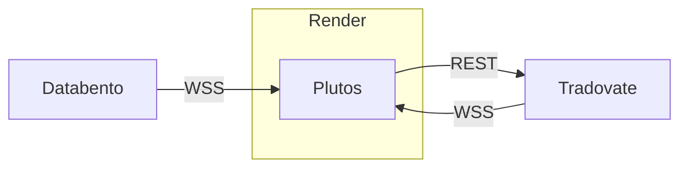
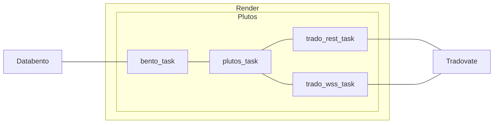

Plutos architecture
=======================

Diese Dokuement enthält die wesentlichen Architekturentscheidungen von Plutos

Plutos als Webservice
----------------------------

1. Plutos soll ein Webservice werden und soll bei einem Webservice Hoster 24/7 (bzw. 23/5) betrieben werden,
   damit er während den ganze CME Öffnungszeiten handeln kann.
1. Ein Web-Interface macht seinen internen Zustand erkenntlich und steuerbar,
   damit er bequem von überall beobachtet, überwacht und gesteuert werden kann.
1. Der Webservice Hoster ist render.com, damit das Deployment bequem über GitHub möglich ist.
   Die Webadresse ist https://plutos-bot.onrender.com
1. Wenn möglich soll der Service auf ein Host und USA nahe Chicago betrieben werden,
   damit die Latenzen für den Empfang von Echtzeitdaten möglichst gering sind.
1. Der Webservice wird in Python geschrieben, damit die Vorteile dieser Sprache
   und die vielen vorhanden Bibliotheken genutzt werden können.
1. Der Quellcode wird auf GitHub verwaltet,
   damit das natlose Deployment mit Render funktioniert 
   und andere Personen an der Entwicklung teilhaben können.
   Das Repository ist https://github.com/andreas-lehn/plutos
1. Der Webservice wird als FastAPI Applikation geschrieben,
   damit die moderne Architektur eine asynchronen Webservers eingesetzt werden kann.

Trader und Datenlieferant
-----------------------------

1. Tradovate ist der Broker von plutos, weil er die beste API für den Handel anbietet.
   Er wurde nach dem API-first Prinzip entwickelt.
   Das wollen wir nutzen.
1. Databento ist der Lieferant der Echtzeitdaten Kursdaten,
   damit wir sein Angebot an historischen Daten nutzen können,
   bevor wir viel Geld für eine CME-Lizenz ausgeben müssen.
   Zudem ist Databento sehr weit verbreitet und bietet eine sehr einfache API an.
   Das macht Databento zur ersten Wahl.

Toplevel Architektur
-----------------------

### Statik

### Dynamic

Für die HTTP/REST-Anfragen an unseren Webservice hat FastAPI bereits eine Task per Default.
Um die Verbindungen zu den Nachbarsystemen herzustellen, 
erzeugen wir für jede Verbindung einen Task,
der sich exclusiv um diese Verdingund kümmert:

 1. `bento_task`: kümmert sich um die Kommunikation mit Databento
 2. `trado_rest_task`: Ein Task für die REST-Schnittstelle von Tradovate
 3. `trado_wss_task`:  Ein weiterer Task für Tradovate, um die Websocket-Verbindung zu bedienen.

Für das Trading als solches werden wir einen `plutos_task` haben.
Insgesamt ergibt sich dann folgende Task-Archtitektur:

Für jeden Task gibt es eine eigene Klasse: `BentoTask`, `PlutosTask`, `TradoWSSTask`, `TradoRESTTask`.

### Echtzeit-Dynamik: 1-sec-Takt

Der Plutos-Bot muss mit den verbundenen System in Echtzeit kommunizieren.
Er muss schnell und zuverlässig sein, sonst ist der Markt im wahrsten Sinne des Wortes _verlaufen_,
bis wir mit unseren Orders um die Ecke kommen.
Wie bauen also ein Echtzeit-System!

Zufälligerweise hat der Autor sehr viel Erfahrung mit dem Bau von Echtzeitsystemen.
Er ist es gewohnt, innerhalb von wenigen Millisekunden sicherheitskritische Signale
an ein technisches System (meist ein Auto und oft die Lenkung oder Bremse) zu schicken.
Aus dieser Erfahrung heraus ist klar: Echtzeitsysteme baut man *niemals* ereignisgesteuert.

Wir kommen an der Schnittstelle nicht drum herum, auf die Ereignisse der Partnersystem zu reagieren.
Aber die Funktionalität, die auf diese Ereignisse reagiert,
muss auf ein Minimum begrenzt sein!
Analog zu einer Interrupt-Service-Routine: Da drin darf auch nicht gemacht werden,
sonst kommt das ganze System ins Stottern.

Besonders kritisch ist die Schnittstelle zu Databento:
Die Datenrate dieser  Schnittstelle zum Bot kommt,
hängt davon ab, wieviel gerate gehandelt wird.
Ein hohes Handelsvolumen darf den Bot nicht überlasten.

In der Chartanalyse sind Kerzencharts überlich.
Das sind meist Zeitkerzen, manchmal Volumenkerzen
und theoretische gibt es nocht Kontraktkerzen.

Zeitkerzen bzw. Zeitdiskretisierung ist genau der Ansatz,
den man in Echtzeitsystemen anwendet:
Es gibt ein feste Taktung, in der das System tickt.
Diese Taktung muss an die Dynamik des technischen Systems,
das es zu regeln gilt, angepasst sein.
Sicherheitskritischen Regelsysteme, wie das ESP, regeln die Räder im 5ms-Zyklus.
Für langsam fahrende Auto in Parkhäusern sind dagen 100ms oder 0.1 Sekunden ausreichend.

Da unser Bot über das Internet mit externen System kommuniziert
und das Latenzen in der Größenordnung von 100ms auftreten können,
erscheint es angemessen, die Bot in einem 1-sec-Takt laufen zu lassen.
Das bedeutet, der Bot macht jede Sekunde immer genau das gleiche.

Damit das gut funktioniert, müssen die Eingangsdaten in 1-sec-Samples zur Verfügung sehen.
Da wir Ticks-Daten von Databento erhalten, ist die einzige Aufgabe des `DatabentoTask`,
diese Tickdaten entgegen zu nehmen und dem Rest der Anwendung in 1-sec-Samples zur Vefügung zu stellen.

### Alles in `int`

Der Kurs des E-mini Nasdaq-Futures (und auch andere Futures) ist nicht kontinuierlich,
sonder ändert sich in 0.25 Punkte Schritten.
Das ist kein Zufall: Die Menschen, die dieses System bauten, wussten was sie taten!

Eine Wert mit der Genauigkeit von 0.25 erhält man, wenn man eine Ganzzall durch 4 teil.
Eine Teilung durch 4 entsprichte in einem Binären-Zahlensystem das Verschieben des Kommas um 2 Stellen.
Ein Computer muss beim Teilen durch 4 gar nicht rechnen, genauso wenig wie wir Menschen rechnen müssen,
Wenn wir durch 100 teilen.

Da bedeutet: Jeder Kurs kann mit einer Ganzzahl dargestell werden
und alle Rechnungen können komplett in Ganzzahl-Arithmetik erfolgen.
Ganzzahl-Arithmetik hat den Vorteil, dass die Zahlen weniger Speicherplatz benötigen,
aber vor allen, dass sie blitzschnell ist.
Auch wenn dieser Vorteil bei modern Architekturen
mit in Hardware integrierten Beschleuniger nicht mehr so genz zum Tragen kommt,
ist das dennoch ein ganz starke Vereinfachung.

Zu guter letzt gibt es aber einen viel wichteren Punkt,
die Kurzse mit Ganzzahlen darzustellen:
Falls man Histogramme erstellen möchte,
dann kann der Kurs direkt als Index in ein Array mit den Häufigkeiten verwendet werden.
Das ist elegant und schnell und kann nicht von einem Hardware-Beschleuniger gemacht werden.

Deshalb: Plutos rechnet alles in 'int'

### Zeitstempel als 'int'

Zu guter Letzt ist in einem Echtzeitsystem oft noch wichtig,
das alter der Daten zu kennen oder zu welchem Zeitpunkt ein entscheidung getroffen wurde.
Dafür werden Daten mit Zeitstempeln versehen.

Plutos verwendet als Zeitstempel ein Ganzzahl.
Da wir im Sekundentakt ticken,
gibt der Zeitstempel die Sekunden seit Sessenbeginn an.
Ein Zeitstempel von 0 bedeutet also: 17 Uhr Chicago Time,
weil da die Session beginnt.

Das letzte Sample hat den Zeitstempel:

    60 * 60 * 23 - 1 = 82800 - 1 = 82799

Mit dem Sekunde seit Session-Start,
können wir wieder den Index-Tricke machen:
Wir speichern unsere Daten in einer Tabelle(numpy.Array) mit 82800 Zeilen
Dann ist der Zeitstempel der Intex in dieser Tabelle.
Wir müssen dann den Index noch nicht mal in den Daten speichern 
und können blitz-schnell auf alte Daten zugreifen.

Damit wird der Rechenaufwand auf ein Mindestmaß gesenkt.
Vermutlich werden die Berechnungen des Bots im Sub-Milli-Sekunden Bereich ablaufen.
Wir werden damit nur durch die Latenz der Verbindungen zu den anderen Systemen ausgebremst.
