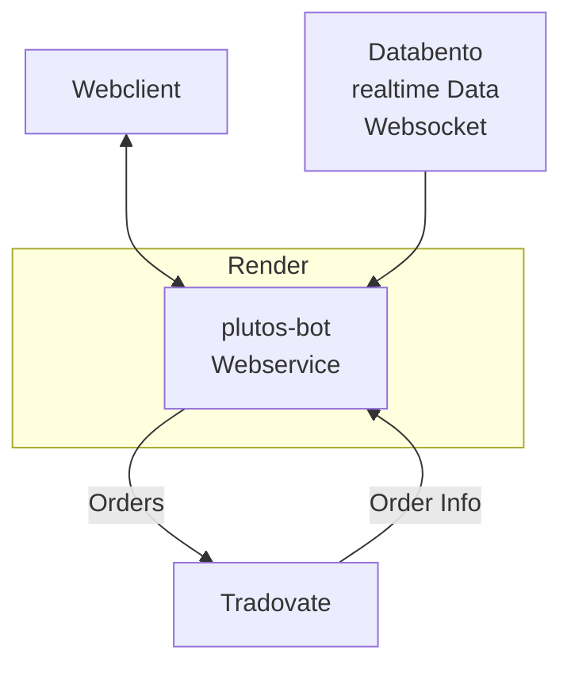
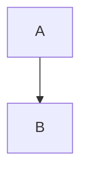

Plutos architecture
=======================

Diese Dokuement enthält die wesentlichen Architekturentscheidungen von Plutos


Plutos als Webservice
----------------------------

1. Plutos soll ein Webservice werden und soll bei einem Webservice Hoster 24/7 (bzw. 23/5) betrieben werden,
   damit er während den ganze CME Öffnungszeiten handeln kann.
1. Ein Web-Interface macht seinen internen Zustand erkenntlich und steuerbar,
   damit er bequem von überall beobachtet, überwacht und gesteuert werden kann.
1. Der Webservice Hoster ist render.com, damit das Deployment bequem über GitHub möglich ist.
   Die Webadresse ist https://plutos-bot.onrender.com
1. Wenn möglich soll der Service auf ein Host und USA nahe Chicago betrieben werden,
   damit die Latenzen für den Empfang von Echtzeitdaten möglichst gering sind.
1. Der Webservice wird in Python geschrieben, damit die Vorteile dieser Sprache
   und die vielen vorhanden Bibliotheken genutzt werden können.
1. Der Quellcode wird auf GitHub verwaltet,
   damit das natlose Deployment mit Render funktioniert 
   und andere Personen an der Entwicklung teilhaben können.
   Das Repository ist https://github.com/andreas-lehn/plutos
1. Der Webservice wird als FastAPI Applikation geschrieben,
   damit die moderne Architektur eine asynchronen Webservers eingesetzt werden kann.


Trader und Datenlieferant
-----------------------------

1. Tradovate ist der Broker von plutos, weil er die beste API für den Handel anbietet.
   Er wurde nach dem API-first Prinzip entwickelt.
   Das wollen wir nutzen.
1. Databento ist der Lieferant der Echtzeitdaten Kursdaten,
   damit wir sein Angebot an historischen Daten nutzen können,
   bevor wir viel Geld für eine CME-Lizenz ausgeben müssen.
   Zudem ist Databento sehr weit verbreitet und bietet eine sehr einfache API an.
   Das macht Databento zur ersten Wahl.


Toplevel Architektur
-----------------------

```text
                                ┌──────────────┐
                                │  Webclient   │
                                └──────┬───────┘
                                       ▲
                                       │
                                       ▼
                        ╔══════════════╧══════════════════════════╗
                        ║ Render                                  ║
                        ║                                         ║
┌──────────────┐        ║   ┌─────────────────────────────────┐   ║        ┌──────────────┐
│ Databento    │────────╫──►│ plutos-bot: FastAPI             │   ║ Orders │ Tradovate    │
│              │        ║   │                                 │───╫───────►│              │
└──────────────┘        ║   │ https://plutos-bot.onrender.com │   ║        │              │
  [realtime Data]       ║   │                                 │   ║  Order │              │
  (Websocket)           ║   │                                 │◄──╫────────│              │
                        ║   └─────────────────────────────────┘   ║   Info └──────────────┘
                        ╚═════════════════════════════════════════╝
```
Statischer Architektur von Plutos




