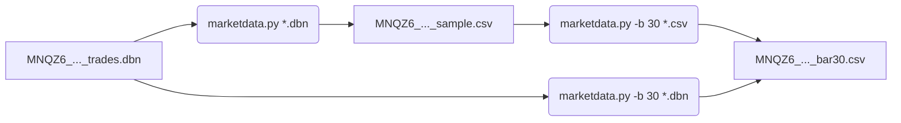
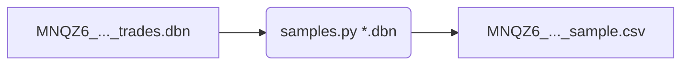

From prototyping to Excel engineering
========================================

Die bisherigen Untersuchung und Erkenntnisse sind über das Schreiben eines Prototyps von Plutos entstanden.
Diese Prototypen versuchten das Verhalten so gut wie möglich auf Basis von aufgezeichneten historischen Daten nachzubilden.
Dabei war die ganze Kette involviert:

 * Historische Daten einlesen und verarbeiten
 * Daten analysieren und darauf Signale ableiten
 * Kauf/Verkauf simulieren
 * Erfolg anhand der Trades ermitteln

Das war eine sehr gute Übung, um ein Gefühl für die ganze Sache zu erhalten.
Allerdings ist die Kette sehr lang und hat viele Parameter, die das Ergebnis beeinflussen.
Zudem ist ein Prototyp manchmal fehlerhaft und kann dadurch in die Irre führen.
Zu guter Letzt mangelt es oft an Transparenz, was tatsächlich passiert ist und warum.
Der Prototyp ist eine Black-Box.

Aus diesen Gründen erscheint jetzt eine Änderung des (Forschungs-)Ansatzes hilfreich.
Anstatt alles in ein ganzheitliches Computerprogramm zu packen,
kann der Elefant in mindestens drei Teile zerlegt werden, 
die isoliert betrachtet werden können:

 1. Vorverarbeitung der rohen historischen Daten in lesbare und handhabbare Einheiten
 2. Das Erkennen von Kauf-/Verkaufsignalen und Bewertung der Qualität der Erkennung
 3. Das Verhalten während eines Trades.

Diese 3 Punkte sind relativ unabhängig voneinander:
Die Strategie, ob und wie man den Stop-Loss-Kurs nachführt,
ist unabhängig vom Algorithmus, der das Signal zu Einstieg geliefert hat.
Umgekehrt leidet die Qualität des Einstiegssignal nicht darunter,
ob der Handelsalgorithmus dann Mist baut und den Trade versemmelt.
Diese Punkte sollten deshalb unabhängig voneinander behandelt und untersucht werden.

Die Schnittstelle zwischen 1 und 2 ist das 1-Sekunden-Sample.
Das ist die kleinste Einheit, die vom Rest der Software verarbeitet werden kann.
Diese Daten sind kompakt und leicht in .csv Dateien speicherbar.
Ein Beispiel:

    timestamp,open,high,average,low,close,volume
    0,123147,123148,123146,123145,123148,10
    1,123149,123149,123147,123145,123146,17
    2,123149,123149,123149,123149,123149,2
    3,123148,123148,123146,123145,123145,2
    4,123145,123145,123145,123145,123145,2
    5,123145,123145,123145,123145,123145,1
    6,123143,123143,123143,123142,123142,8
    7,123144,123145,123144,123141,123143,14
    8,123146,123146,123145,123143,123146,11

Das sind 9 1-Sekunden-Samples. 
Sie sind erzeugt aus den Rohdaten von Databento.
Der Ausschnitt beginnt eine Stunde nach Handelsstart in der CME-Session vom 28.09.2026.
Das native Format von Databento (.dbn) ist ein binäres Format
und deshalb nicht lesbar und auch nicht mit Standard-Tools verarbeitbar.

Das 1-Sekunden-Sample hat den typischen Aufbau einer Kerze,
mit einer Erweiterung: `average` ist der gewichtet Durschnittskurs.
Wie man auch erkennen kann, sind im 1-Sekunden-Samples die Kurse bereits als Ganzzahlen enthalten.
Um auf den _richtigen_ Kurs zu kommen müssen die Zahlen durch 4 geteilt werden.
Für das erste Sample (Zeitstempel 0) wäre das wie folgt:

        open      high   average       low     close
    30786.75  30787.00  30786.50  30786.25  30787.00

Diese Samples können weiterverabeitet werden.
Daraus können die benötigen Kerzen sehr leicht errechnet werden.
Das folgende Beispiel zeigt 3 3s-Kerzen, die aus den obigen 9 1-Sekunden-Sample erzeugt wurden.

    timestamp,open,high,average,low,close,volume
    0,123147,123149,123147,123145,123149,29
    3,123148,123148,123145,123145,123145,5
    6,123143,123146,123144,123141,123146,33

Alle diese Daten wurden mit `marketdata.py` erzeugt.
`marketdata.py` erzeugt aus Databento-Daten 1-Sekunden-Samples oder Zeitkerzen beliebiger Länge.
Zusätlich erzeugt es aus gespeicherten 1-Sekunden-Sample auch wieder Zeitkerzen beliebiger Länge.

Volumentkerzen werden nicht unterstützt.
Volumenkerzen konnten bisher keine Vorteile gegenüber Zeitkerzen zeigen.
Aber wegen ihre Volumen-basierten und nicht Zeit-basierten Natur passen sie nicht gut in ein Echtzeitsystem.
Deshalb ist die Verwendung von Volumentkerzen aktuell nicht mehr Untersuchungsgegenstand.

Die folgende Darstellung gibt einen Überblick,
wie `marketdata.py` zur Erzeugung der grundlegenden Daten verwendet werden kann:

`marketdata.py` erkennt an der Endung (`.dbn`, `.csv`) der Input-Datei,
welches Format die Eingangsdaten haben.
Wird über `-b` oder `--barsize` die Kerzengröße angegeben,
dann erzeugt `marketdata.py` Kerzen dieser Länge.
Egal welches Format die Eingangsdaten haben,
am Ende kommt dasselbe raus.

Es gibt noch einen weiteren Weg,
um aus den Databento `.dbn`-Dateien 1-Sekunden-Samples zu erzeugen: `samples.py`

`samples.py` geht einen anderen Weg:
Es nutzt Pandas, ein Art Tabellenkalkulation für Python.
Dieser zweite Weg ermöglicht es, die von `marketdata.py` generierten Daten zu validieren.
Es muss über beide Wege dasselbe rauskommen.

Wenn wir die Rohdaten in lesbaren .csv-Dateien haben, dann kann damit nicht nur Pandas arbeiten,
sondern auch Excel!
Das bedeutet, dass wir Excel (oder eine andere Tabellenkalkulation) verwenden können,
um Untersuchungen und Bewertungen durchzuführen.
Das ist der Weg von der Protoypen-Entwicklung zum Excel-Engineering!

Mit den jetzt vorliegenden Werkzeugen ist der Punkt 1
_Vorverarbeitung der rohen historischen Daten..._ gelöst.
